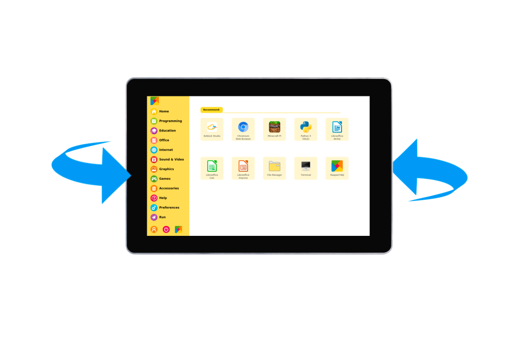
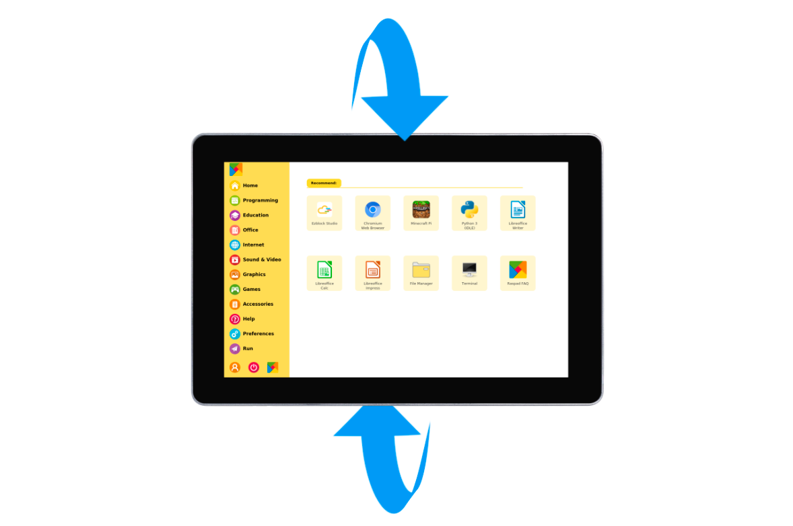

## RASPAD3 exclusive
### Q: Can the battery be replaced?
A: Considering that this involves design issues and requirements for battery volume, it is not recommended to replace the battery.

### Q:Can you consider changing the power charging interface to Type-C?
A: We will consider this suggestion.

### Q:What is the power of adapter?
A: It is 30W.

### Q:What are the specifications of adapter interface?
A: The specification of the adapter interface is 5.5 mm x 2.1mm, with DC 15V.

### Q:Would it be possible to release the case as STL files so it can be modded by the community?
A: Sorry, the STL files are not public.

### Q: Is the battery a standard 18650 cluster that one might be able to add additional cells in parallel "unofficially" of course?
A: It uses a standard 18650 battery pack. If you want to make a parallel battery pack, you need to make a battery protection board to protect the battery.

### Q: Can the RasPad be used as a monitor for the Jetson Nano for AI? 
A: Not support, RasPad3 does not support external devices.

### Q:Limited access to the GPIO and Camera
A: We reserved all the GPIO slot on raspberry pi for users, to keep the possibility for RasPad. And you will just need to prepare a GPIO break out board for the expansion. For the breakout cables, the usual 40-pin rainbow cable will be fine.
Since we consider the camera as an extension, it is currently not support to fix the camera on the Raspad.

### Q:Ethernet does not work
A: Normally, this situation should rarely occur, as we have tested several of our existing sample machines, and each of their Ethernet port seems work well, and also will not cause the Raspberry Pi WIFI to be turned off. 
Meanwhile, we have recorded this feedback and will inspect it carefully in the final production stage to ensure that the Ethernet port will not become a problem factor that hinders the use of raspad.

### Q:Fan is incredibly noisy
 A: In the recent A/B tests, we appropriately lower the fan speed (to reduce noise) while ensuring the cooling performance of the fan. With the indoor-temperature is 25℃, and the CPU is 100% occupied, the temperature is 68℃ when the fan is almost silent status, and 65℃ when the fan is running at full speed.

### Q:External display disable touchscreen
A: For the touch screen, as the touch driver Raspberry Pi OS provided treated the dual display as one long display. So half of the touch sensor will control the RasPad, and other half control the others. Makes it not possible to use. But we will try to find a better solution.

### Q:Battery life is less than quoted
A: 5h battery life is tested under standby. Which it only turns on, and stays there. It’s almost not possible to boost video playback time to 5h as battery pack is already 3000mAh, 33wh, it will cost too much.

### Q:The direction of the display does not change with the direction of the screen 
This is because the built-in six-axis sensor is not calibrated
1. First, open the raspberry pie terminal
2. Then enter the command "sudo auto-rotator calibrate" to start the calibration script
3. Enter's'into calibration mode
4. The operations for calibration are as follows
    1. Raspad facing forward,,turn left to right
        
    2. Back to the front of raspad3,Spin from top to bottom
        
    3. Back to the front of raspad3,Press "Ctrl + C" to end the script
5. Finally, enter the command "sudo reboot" and restart raspad3   

